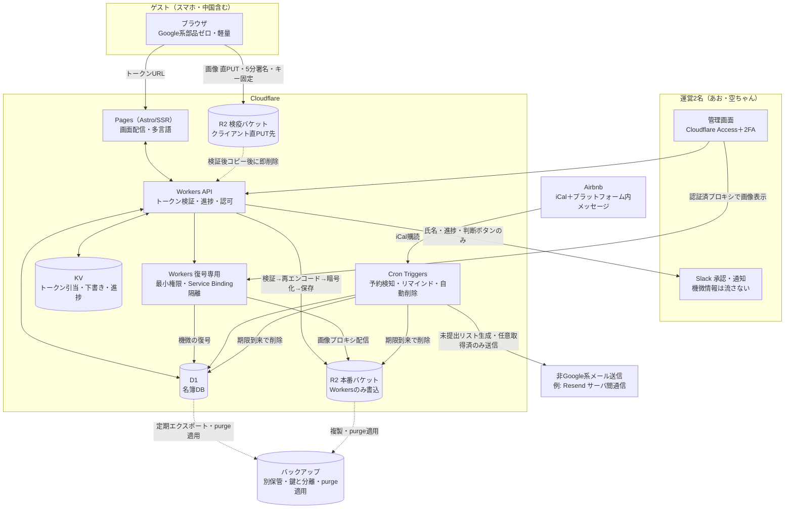
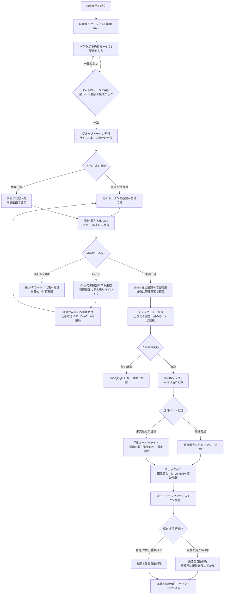
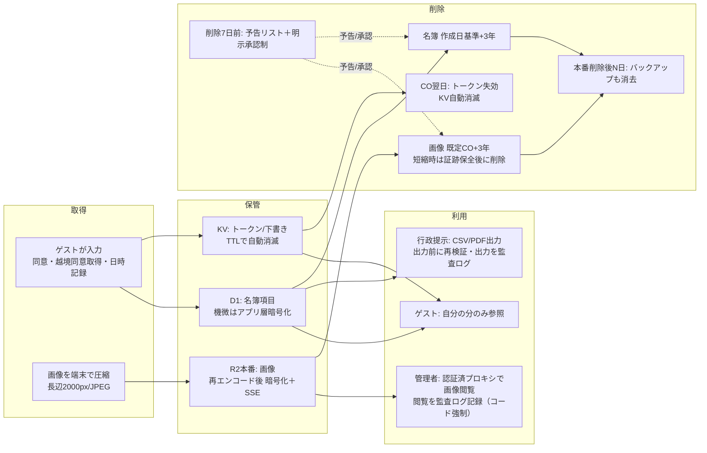

# Hilltop Zushi 宿泊者名簿アプリ — 設計書（v1.2）

> **v1.1 追記（2026-06-28・オーナー指示）**: 末尾「⑰ 追加要件」を参照。人数の代表者申告フロー／重要事項の強い明示（人数厳守・超過3倍・法令協力）／代表者のみの「選んだ理由」設問／全員のメール収集＋任意マーケ同意＋Googleマップ評価で10%オフ、を追加。**付加要素は軽く、名簿収集を主役に**が方針。
>
> **v1.2 追記（2026-06-29・オーナー決定）**: 未決#1＝データ保存期間は**5年**（法定名簿3年以上を満たすオーナー方針）／未決#6＝超過は**1名につき通常追加料金の3倍**・Googleマップ評価クーポンは**10%OFF**で確定。詳細は「⑰ 17-0 決定事項」。

> 読み手はコード初心者の民泊オーナーです。専門用語には1行の噛み砕き説明を添えています。各章は「結論 → 詳細」の順です。
> 本書は監査レビューの指摘（重大度「高」「中」）をすべて反映済みです。反映箇所には【レビュー反映】の印を付けています。

---

## 目次

1. 概要と全体像
2. 用語集
3. システム構成図
4. 画面一覧
5. データ項目表とD1スキーマ
6. 業務フロー図
7. データのライフサイクル図
8. セキュリティ・プライバシー
9. 法令対応マッピング表
10. 中国アクセス対策
11. 多言語（日/英/中）
12. 運用フロー
13. MVPと段階的拡張
14. リスクと対策表
15. 未決事項（オーナー判断が必要な点）
16. レビュー反映サマリー

---

## ① 概要と全体像

### 何を作るのか（1行）
Airbnb予約ごとに「グループ専用URL」を発行し、最大12名の宿泊者が**自分のスマホから法定名簿項目を入力**できる、中国本土からもアクセスできる多言語Webアプリ。Googleフォームの置き換え。

### なぜ作るのか（解決する課題）
- **中国本土の問題**: Googleフォームは GFW（金盾＝中国のネット検閲システム）でブロックされ、中国ゲストが入力できない。
- **入力の柔軟性**: 各自入力と代表者一括入力の両方に対応したい。
- **進捗が見えない**: 「誰が出して誰が未提出か」が分からない。
- **法令とプライバシー**: 旅券番号・画像など機微情報（取扱いに特に注意がいる重要な個人情報）を、法律を守りつつ安全に扱いたい。

### 中核となる設計判断（全体の約束事）
1. **データ構造は「予約（親）＋宿泊者（子）」の1対多** … これだけで「各自入力」も「代表一括入力」も同じ形で表せる。
2. **トークン（合言葉URL）は2階層**（グループ用＋個人用）。DBには生のトークンを保存せず**ハッシュ**で保存。
3. **機微情報（旅券番号・画像・住所・電話）はアプリ層で暗号化**して保存。鍵はオーナーが握る。
4. **進捗・他人に見せる情報は「氏名＋提出済/未提出」だけ** … 機微情報はAPIのレスポンスにそもそも含めない（フロントで隠すだけでは不可）。
5. **中国対策の本丸はフロント徹底軽量化＋Google系部品ゼロ**。残りは中国系フォーム併用などの保険。
6. **【レビュー反映 A-1/B-1/C-1/F-1】機微情報の保存期間・本人確認の証跡・入口の本人性・運用ゲートは「法令と現場運用の両立」を最優先**で設計し直した。詳細は各章と⑯参照。

### 採用技術スタック（手持ち資産で実現）
| 部品 | 役割（1行説明） |
|---|---|
| Cloudflare Pages（Astro/SSR） | 画面を配信。Astro＝基本HTMLだけ吐く軽量サイト生成ツール |
| Cloudflare Workers | API（裏側の処理）。トークン検証・暗号化・進捗計算 |
| Cloudflare D1 | 名簿データベース。SQLite互換（＝1ファイルで動く軽量DB） |
| Cloudflare R2 | パスポート画像の保管庫（非公開バケット＝鍵がないと中身を見られない倉庫） |
| Cloudflare KV | トークン引き当て・下書き・進捗の簡易メモ帳（自動消滅つき） |
| Cloudflare Cron Triggers | 定時バッチ。予約検知・リマインド・自動削除 |
| Slack | 運営2名の審査・承認連絡（機微情報は本文に流さない／後述） |

---

## ② 用語集（初心者向け1行説明）

| 用語 | 噛み砕き説明 |
|---|---|
| GFW（金盾） | 中国政府のネット検閲システム。海外サイトを遅くしたり遮断したりする「壁」 |
| トークン | 合言葉付きの長いランダム文字列。URLに含め「これを知る人だけ入れる」鍵 |
| グループトークン | 予約1件ぶんの入口の鍵。代表者が使う |
| 個人トークン | 宿泊者1人ぶんの鍵。自分の1人分だけ入力できる |
| ハッシュ | 文字列を不可逆に変換した値。元に戻せない（流出しても悪用しにくい） |
| 暗号化 | 中身を読めなくして保管すること。鍵がないと戻せない |
| エンベロープ暗号化 | 「データを鍵Aで暗号化→鍵Aを親鍵で暗号化」する封筒方式 |
| KEK / DEK | KEK＝親鍵（マスター鍵）／DEK＝1件ごとの使い捨てデータ鍵 |
| Workers Secrets | プログラムだけが使える金庫。暗号鍵やパスワードを安全に置く場所 |
| Service Binding | Worker同士を内部だけで安全につなぐ仕組み（外部に出ない通信） |
| 署名付きURL | 「この1ファイルを◯分だけ扱ってよい」期限付きの許可証 |
| presigned PUT | アップロード専用の署名付きURL。クライアントがサーバを通さず直接保存できる |
| SSE | R2側のサーバ暗号化（保管メディアの暗号化）。アプリ層暗号化と二重化 |
| 再エンコード | 画像を一度「絵」として読み直して作り直すこと。隠し攻撃コードやGPS情報を落とせる |
| マジックナンバー | ファイル先頭の種別識別子（JPEG/PNGの見分け） |
| ポリグロット | 複数のファイル形式に解釈できる細工ファイル（攻撃に悪用される） |
| IDOR | 番号を書き換えて他人のデータを覗く攻撃。番号を受け取らない設計で防ぐ |
| ハニーポット | 人間に見えない罠の入力欄。そこに値が入ればbot判定 |
| WAF | 通信の門番。ルール違反の大量アクセスを自動で弾く |
| レート制限 | 一定時間に決めた回数を超えたアクセスを一時的に止める仕組み |
| CGNAT | 多数の人で同じIPを共有する回線（中国で多い）。IP単位の制限が誤爆しやすい |
| iCal | Airbnbのカレンダーを読み取る予定表データの共通形式 |
| UPSERT | 「あれば更新・なければ追加」をまとめて行うDB操作 |
| ICT本人確認 | 対面せずIT（画像アップロード等）で本人確認すること。観光庁が容認 |
| 越境移転 | 個人データを日本国外のサーバーに移すこと。本人同意が必要 |
| Cron Triggers | 「毎日◯時に自動実行」のタイマー機能 |
| 民泊新法 | 正式名称「住宅宿泊事業法」。民泊オーナーが守る法律 |
| PPC（個人情報保護委員会） | 個人情報の扱いを監督する国の機関。漏えい時の報告先 |
| ICP備案 | 中国国内にサーバを置く場合に必要な中国政府への届出（今回は不要） |
| ハッシュチェーン | 各記録に前の記録のハッシュを含め、改ざんすると後ろが全部壊れる仕組み |

---

## ③ システム構成図（Mermaid）



> **【レビュー反映 B-1】** 画像は「検疫バケット（クライアント直PUT専用）」と「本番バケット（Workersのみ書込）」を**物理的に別バケット**にし、本番へはクライアントが直接書けない構成にした。
> **【レビュー反映 B-3/B-4】** 機微情報の復号と画像配信は**復号専用Worker**に隔離し、画像は署名URLをクライアントに渡さず**認証済みプロキシ配信**にした。

---

## ④ 画面一覧と各画面説明

### ゲスト側（スマホ前提）
| # | 画面 | 目的 | 入口 |
|---|------|------|------|
| G0 | 言語選択 | 日/英/中（簡体・繁体）を選ぶ（端末標準フォント・軽量1ページ） | グループURL初回 |
| G1 | グループ入口・進捗ダッシュボード | 全体状況把握と作業選択。進捗バー「12人中9人」＋**氏名＋済/未バッジのみ** | グループトークンURL |
| G2 | 入力方式の選択 | 「自分の分だけ（推奨）」or「代表が全員分」。**プライバシー上は各自入力を既定で推奨表示** | G1 |
| G3 | 本人情報フォーム（1名分） | 各自が自分の法定項目を入力。下書き自動保存 | 個人トークンURL / G2 |
| G4 | 代表者一括入力 | 人数ぶんの折りたたみカード。済みは緑チェックで畳む | G2 |
| G5 | パスポート撮影/アップロード | 長辺2000px縮小＋JPEG圧縮→検疫バケットへ直PUT。分割＋リトライ | G3/G4内 |
| G6 | 入力内容の確認 | 送信前チェック＋**プライバシー同意（必須）＋越境移転同意（必須）** | G3/G4 |
| G7 | 個人完了画面 | 提出完了＋全体進捗へ戻る。再アクセスで修正可 | G6送信後 |
| G8 | グループ完了画面 | 全員完了の案内（暗証番号はここに出さない＝人手・短命リンクで送付） | 全員完了時 |
| G9 | 期限切れ/無効URL | 失効案内＋ホスト連絡導線（情報は一切返さない） | トークン失効時 |
| G10 | プライバシーポリシー | 多言語。委託先・**越境移転先の国名**・保存期間・画像保存目的・開示請求窓口を明記 | G0/各フォーム冒頭 |
| G11 | 入口（/start・予約確認） | 予約番号＋**もう1要素**を入力→iCal突合→一致でグループURL発行 | Airbnb自動メッセージのURL |

> **【レビュー反映 E-1】** 入口画面G11では予約番号だけでなく**もう1要素（姓・チェックイン日・人数のいずれか）**を必須にし、なりすまし・総当たりを防ぐ。入力には強いレート制限＋失敗ロックをかける。グループトークンは予約に1本だけ発行し、再発行は管理者操作に限定。

### 管理者側（スマホ＋PC両対応）
| # | 画面 | 目的 |
|---|------|------|
| A0 | 管理者ログイン | 2名のみ・2要素（Cloudflare Access＋パスキー/TOTP）。リカバリコード保管手順あり |
| A1 | 予約一覧ダッシュボード | 予約ごとの進捗（9/12）・要対応バッジ（未提出/⚠/未承認） |
| A2 | 名簿詳細（予約単位） | 全宿泊者を一覧。法定必須の欠落を赤表示。⚠/✅照合バナー |
| A3 | パスポート画像確認 | **認証済みプロキシ配信**で表示・氏名/旅券突合・**閲覧を監査ログ記録（コード強制）** |
| A4 | 承認＆暗証番号送付 | ⚠/✅提示→人が判断→**手動オーバーライド（理由必須・監査ログ）可** |
| A5 | リマインド管理 | 未提出リスト＋**ワンクリックでコピーできる多言語リマインド文**（Airbnbへ手動貼付が一次経路） |
| A6 | エクスポート | 法定名簿のCSV（**Shift_JIS既定／UTF-8選択可**）＋PDF。**出力前に現行ルールで再検証** |
| A7 | 監査ログ | 誰が・いつ・どの予約の・何を（画像閲覧/暗証送付/出力）を時系列表示。**追記専用・削除APIなし** |

### 入力フォームの項目順（スマホで指の移動を最小化）
1. 区分（代表/同行・ラジオ／代表のみ電話欄が出現）→ 2. 氏名（パスポート綴り・英字推奨）→ 3. **日本国内住所の有無（Yes/No）** → 4. 国籍（22種＋その他・よく来る国を上位固定）→ 5. 旅券番号（半角英数・自動大文字化）→ 6. パスポート画像（国内住所なし外国人は必須）→ 7. 住所 → 8. 職業（8種）→ 9. 年齢（数字キーボード）→ 10. 性別（MALE/FEMALE/X）→ 11. 前泊地/後泊地（任意）→ 12. 電話番号（代表必須・**同行者も任意で当日連絡先を入力可**）

> **【レビュー反映 C-3】** 緊急時に「代表者だけが帰国して残留ゲストに連絡できない」事態を避けるため、同行者にも**任意の当日連絡先**欄を用意した（法定は代表のみで足りるが運用保険）。
> 「日本国内住所の有無」がNoのとき、国籍・旅券番号・画像を必須化する（法令の条件付き必須）。

---

## ⑤ データ項目表とD1スキーマ

### 既存フォーム項目 → カラム対応表
| 既存フォーム項目 | 保存先 | 単位 | 備考 |
|---|---|---|---|
| 代表/同行の別 | `guests.member_role` | 個人 | representative / companion |
| 氏名 | `guests.full_name` | 個人 | 提出時必須・パスポート綴り推奨 |
| 住所 | `guests.address` 🔒 | 個人 | 暗号化 |
| 日本国内住所の有無 | `guests.has_jp_address` | 個人 | 条件付き必須の判定用 |
| 前泊地 | `guests.prev_stay` | 個人 | |
| 後泊地 | `guests.next_stay` | 個人 | |
| 職業（8種） | `guests.occupation` | 個人 | コード保存 |
| 国籍（22種＋他） | `guests.nationality` / `nationality_other` | 個人 | OTHER時のみother |
| 旅券番号 | `guests.passport_no` 🔒 | 個人 | 暗号化必須 |
| 電話番号 | `guests.phone` 🔒 | 個人 | 代表必須・同行任意 |
| パスポート画像 | `guests.passport_img_key` 🔒＋mime/size/uploaded_at | 個人 | 実体はR2本番バケット・10MB検証 |
| 年齢 | `guests.age` | 個人 | |
| 性別 | `guests.gender` | 個人 | MALE/FEMALE/X |
| チェックイン/アウト日 | `reservations.check_in_date` / `check_out_date` | 予約 | 予約単位1回 |
| 宿泊日数 | `reservations.nights` | 予約 | 算出保存 |
| 予約番号 | `reservations.airbnb_reservation_code` | 予約 | 予約単位1回 |

> 凡例: 🔒＝アプリ層で暗号化。選択肢（職業8種・国籍22種）は**コード値**で保存し、表示名（日英中）はアプリ辞書で出し分け。

### D1 スキーマ（CREATE TABLE）

```sql
-- 予約（グループ）
CREATE TABLE reservations (
  id                TEXT PRIMARY KEY,
  airbnb_reservation_code TEXT,                 -- NULL可（手動作成予約あり）
  property_name     TEXT NOT NULL DEFAULT 'Hilltop Zushi',
  check_in_date     TEXT NOT NULL,              -- YYYY-MM-DD
  check_out_date    TEXT NOT NULL,
  nights            INTEGER NOT NULL,
  expected_guests   INTEGER NOT NULL,           -- 進捗の分母（最大12）
  preferred_lang    TEXT NOT NULL DEFAULT 'ja', -- ja/en/zh-CN/zh-TW
  ical_uid          TEXT,                        -- iCal由来の予約識別子（UPSERTキー）
  status            TEXT NOT NULL DEFAULT 'open',-- open/closed/cancelled
  review_status     TEXT NOT NULL DEFAULT 'pending', -- pending/approved/rejected
  pin_sent_at       TEXT,
  pin_override      INTEGER NOT NULL DEFAULT 0,  -- 1=暗証番号を手動オーバーライド送付した
  pin_override_reason TEXT,                       -- オーバーライド理由（監査用）
  created_at        TEXT NOT NULL,
  updated_at        TEXT NOT NULL,
  data_purge_at     TEXT NOT NULL               -- 名簿本体の削除予定（後述の起算で算出）
);
-- 【レビュー反映 E-2】UPSERTの安定キーは ical_uid。airbnb_reservation_code はUNIQUEにしない。
CREATE UNIQUE INDEX idx_res_ical ON reservations(ical_uid);
CREATE INDEX idx_res_airbnb ON reservations(airbnb_reservation_code); -- 非UNIQUE
CREATE INDEX idx_res_status ON reservations(status);

-- 宿泊者メンバー
CREATE TABLE guests (
  id                TEXT PRIMARY KEY,
  reservation_id    TEXT NOT NULL,
  member_role       TEXT NOT NULL,              -- representative/companion
  slot_no           INTEGER NOT NULL,           -- 1〜12（slot_no=1を代表）
  -- 法定・収集項目
  full_name         TEXT,
  has_jp_address    INTEGER,                    -- 1=日本国内に住所あり 0=なし
  address           TEXT,                       -- 🔒（_enc/_iv/_dek/kek_version形式）
  prev_stay         TEXT,
  next_stay         TEXT,
  occupation        TEXT,
  nationality       TEXT,
  nationality_other TEXT,
  passport_no       TEXT,                       -- 🔒暗号化
  phone             TEXT,                       -- 🔒暗号化（代表必須・同行任意）
  phone_role        TEXT,                       -- emergency など同行者連絡先の区別
  age               INTEGER,
  gender            TEXT,                       -- MALE/FEMALE/X
  -- パスポート画像メタ（実体はR2本番バケット）
  passport_img_key  TEXT,                       -- 🔒暗号化
  passport_img_mime TEXT,
  passport_img_size INTEGER,                    -- 10485760(10MB)以内をサーバ検証
  passport_img_uploaded_at TEXT,
  img_purge_at      TEXT,                        -- 画像の削除予定（後述の起算で算出）
  -- 本人確認の代替証跡（画像を消しても残す確認記録）
  idcheck_verifier  TEXT,                        -- 確認者（admin id）
  idcheck_at        TEXT,                        -- 確認日時
  idcheck_passport_tail TEXT,                    -- 旅券番号末尾4桁（証跡用・本体は暗号化済）
  idcheck_note      TEXT,                        -- 確認所見
  id_verified       INTEGER NOT NULL DEFAULT 0,  -- 本人確認（画像突合）済みフラグ
  -- 状態管理
  submit_status     TEXT NOT NULL DEFAULT 'draft', -- draft/submitted/void
  submitted_at      TEXT,
  submit_rule_version TEXT,                       -- 提出時に適用した必須ルールの版（再検証用）
  filled_by         TEXT NOT NULL DEFAULT 'self',  -- self/representative
  consent_at        TEXT,                          -- 同意取得日時
  consent_lang      TEXT,                          -- 同意時の言語
  consent_cross_border INTEGER NOT NULL DEFAULT 0, -- 越境移転同意フラグ
  created_at        TEXT NOT NULL,
  updated_at        TEXT NOT NULL,
  FOREIGN KEY (reservation_id) REFERENCES reservations(id) ON DELETE CASCADE
);
CREATE INDEX idx_guests_res ON guests(reservation_id);
CREATE UNIQUE INDEX idx_guests_slot ON guests(reservation_id, slot_no);

-- グループURLの鍵
CREATE TABLE group_tokens (
  id TEXT PRIMARY KEY, reservation_id TEXT NOT NULL,
  token_hash TEXT NOT NULL, expires_at TEXT NOT NULL,
  revoked_at TEXT, created_at TEXT NOT NULL,
  FOREIGN KEY (reservation_id) REFERENCES reservations(id) ON DELETE CASCADE
);
CREATE UNIQUE INDEX idx_grouptoken_hash ON group_tokens(token_hash);

-- 個人入力URLの鍵
CREATE TABLE guest_tokens (
  id TEXT PRIMARY KEY, guest_id TEXT NOT NULL,
  token_hash TEXT NOT NULL, expires_at TEXT NOT NULL,
  revoked_at TEXT, created_at TEXT NOT NULL,
  FOREIGN KEY (guest_id) REFERENCES guests(id) ON DELETE CASCADE
);
CREATE UNIQUE INDEX idx_guesttoken_hash ON guest_tokens(token_hash);

-- 暗証番号表示用の短命トークン（一度だけ開けるリンク）
CREATE TABLE pin_view_tokens (
  id TEXT PRIMARY KEY, reservation_id TEXT NOT NULL,
  token_hash TEXT NOT NULL, expires_at TEXT NOT NULL,
  viewed_at TEXT,                               -- 閲覧後失効
  created_at TEXT NOT NULL,
  FOREIGN KEY (reservation_id) REFERENCES reservations(id) ON DELETE CASCADE
);

-- 暗証番号履歴（既定はメタのみ。番号本体の常駐保存は任意・オーナー判断）
CREATE TABLE keybox_codes (
  id TEXT PRIMARY KEY, reservation_id TEXT,
  code_enc TEXT,                               -- 🔒（任意。NULL=本体は保存しない運用）
  active INTEGER NOT NULL DEFAULT 1,           -- 1=現在有効
  changed_by TEXT, changed_at TEXT NOT NULL
);

-- 監査ログ（追記専用・改ざん検知つき）
CREATE TABLE audit_logs (
  id TEXT PRIMARY KEY, reservation_id TEXT, guest_id TEXT,
  actor_type TEXT NOT NULL,                     -- admin/guest/system
  actor_id TEXT, action TEXT NOT NULL,
  detail TEXT,                                  -- JSON（差分・送付先・照合スナップショット等。PIIは入れない）
  ip_hash TEXT,                                 -- 日次ローテーションソルトでハッシュ・短期保持
  prev_hash TEXT,                              -- 直前ログのハッシュ（ハッシュチェーン）
  row_hash  TEXT NOT NULL,                     -- 本行のハッシュ
  created_at TEXT NOT NULL
);
CREATE INDEX idx_audit_res ON audit_logs(reservation_id);
CREATE INDEX idx_audit_action ON audit_logs(action);

-- ブラックリスト（氏名等はハッシュで保持・完全一致照合のみ）
CREATE TABLE blacklist (
  id TEXT PRIMARY KEY, match_type TEXT NOT NULL, -- name/passport/phone/address
  match_value_hash TEXT NOT NULL, reason TEXT,   -- 登録理由（具体的トラブル事実のみ）
  severity TEXT NOT NULL DEFAULT 'warn',         -- warn/block
  created_by TEXT, created_at TEXT NOT NULL
);
CREATE INDEX idx_bl_value ON blacklist(match_value_hash);

CREATE TABLE blacklist_hits (
  id TEXT PRIMARY KEY, reservation_id TEXT NOT NULL, guest_id TEXT NOT NULL,
  blacklist_id TEXT NOT NULL,
  match_kind TEXT NOT NULL,                     -- exact（完全一致のみ。あいまい一致は廃止）
  matched_at TEXT NOT NULL, resolved INTEGER NOT NULL DEFAULT 0,
  FOREIGN KEY (reservation_id) REFERENCES reservations(id) ON DELETE CASCADE
);

-- リマインド履歴
CREATE TABLE reminders (
  id TEXT PRIMARY KEY, reservation_id TEXT NOT NULL, guest_id TEXT,
  channel TEXT NOT NULL,                        -- airbnb/email/wechat/slack
  due_date TEXT, sent_at TEXT NOT NULL,
  FOREIGN KEY (reservation_id) REFERENCES reservations(id) ON DELETE CASCADE
);
CREATE INDEX idx_reminders_res ON reminders(reservation_id);

-- バックアップのpurge管理（本番削除後に追随消去）
CREATE TABLE backup_purge_queue (
  id TEXT PRIMARY KEY, target_kind TEXT NOT NULL, -- d1/r2
  target_ref TEXT NOT NULL,                       -- 予約id/画像key等
  source_deleted_at TEXT NOT NULL,
  backup_purge_at TEXT NOT NULL,                  -- 本番削除＋N日後
  purged_at TEXT
);
```

> **暗号化カラムの実装メモ**: 🔒項目は実際には `xxx_enc`（暗号文）/`xxx_iv`（初期化ベクトル）/`xxx_dek`（暗号化したデータ鍵）/`kek_version`（親鍵のバージョン）に分けて格納（エンベロープ暗号化）。上表は論理名で記載。

#### 保存期間の起算ルール【レビュー反映 A-1 / A-2】
- **名簿本体（旅券番号含む）`data_purge_at`**: 住宅宿泊事業法施行規則の名簿保存は**「作成した日から3年」**が法定下限。**オーナー方針で保存期間は5年**とし、**「guests作成日（created_at）とチェックアウト日の遅い方＋5年」**で算出する（法定3年を満たす）【v1.2決定】。
- **パスポート画像 `img_purge_at`**: **名簿と同じ＝CO+5年**（本人確認の証跡保全・オーナー決定）【v1.2決定】。保健所一次照会はブロッカーではなくなった（任意・ICT本人確認の具体要件確認のみ）。
- **バックアップ**: 本番削除後N日でバックアップからも消える（`backup_purge_queue`）。バックアップに残し続けて保存期間超過にならないようにする【レビュー反映 B-5】。

### 「各自入力」と「代表一括入力」を1構造で表す仕組み
1. 予約作成時、`expected_guests` の人数ぶん **空のdraft行**（slot_no=1..N、slot_no=1を代表）を先に作る。
2. **各自入力（推奨）**: 個人トークンで自分の1行だけ編集→submitted（`filled_by='self'`）。
3. **代表一括入力**: グループトークンで全guests行に書き込み可（代理ぶんは`filled_by='representative'`）。
4. 人数ズレ: 増員＝行追加＋`expected_guests`更新／減員＝余り行を`void`。進捗の分母は常に`expected_guests`。

### 進捗「12人中9人」の算出
- **分母** = `reservations.expected_guests` / **分子** = `submit_status='submitted'`の件数。
- **「提出済み」の定義（2026-07-01・v2改訂／オーナー独自ルール）**: 全員＝氏名＋住所＋国籍＋職業（年齢・性別は任意）。「日本国籍かつ国内に現住所あり」の人以外（非居住日本人・外国籍）＝＋旅券写真＋前泊地（旅券番号は求めない・法定より広い独自ルールで法定を下回らない）。代表＝＋電話。代表かつ「日本国籍かつ国内住所あり」＝＋利用用途。判定はAPI側で行い、満たした瞬間にsubmittedを記録し**そのときの必須ルール版を `submit_rule_version` に保存**（旧版=氏名+住所+職業+国籍+年齢+性別必須＋外国人条件付き旅券番号は `2026-06-29.v1` として履歴に残る）。
- **【レビュー反映 E-3】出力前の再検証**: 必須ルールや国籍別ルールが後から変わった場合に備え、A6エクスポート前に**現行ルールで再検証**を走らせ、要件未充足の行を赤表示する。
- **ゲスト共有用クエリ（機微情報を含めない）**: `slot_no, full_name, member_role, (submitted?1:0)` のみ返す。これがプライバシー要件の核。

---

## ⑥ 業務フロー図（Mermaid）



> **【レビュー反映 F-1】** 「全員提出まで暗証番号送付ボタンをグレーアウト」では当日未提出で物理的に入れない詰みが起きる。送付ゲートを「**代表者＋法定上不可欠な人数の提出**」に緩め、残りは**管理者の手動オーバーライド（理由必須・監査ログ）で暫定送付**を正規フローに組み込んだ。
> **【レビュー反映 C-2】** リマインドは「Airbnbプラットフォーム内メッセージ」を一次経路とし、メール/WeChatは任意取得後のみ。Cronは未提出リストと多言語文面を**管理画面に出す半自動**に落とした（Airbnb APIで自動送信できない現実に合わせた）。

---

## ⑦ データのライフサイクル図（取得→保管→削除）



> **削除は不可逆**。誤消去防止のため、削除7日前に「自動削除予定リスト」を管理画面に表示し、**3年保存義務のある名簿は管理者の明示承認がない限り保留→論理削除→猶予後に物理削除の二段**にする【レビュー反映 F-5】。

---

## ⑧ セキュリティ・プライバシー

### トークン設計
- **3種類**: グループ（予約全体）／個人（自分1人）／管理者セッション（全件）。
- **生成**: `crypto.getRandomValues()` で**256bit**乱数→Base64url化（URL安全文字）。総当たり不可。
- **保存**: 生トークンはユーザーにだけ渡し、DBは**SHA-256ハッシュ**のみ。照合は定数時間比較（応答時間差で推測する攻撃を防止）。
- **失効**: `expires_at`（**チェックアウト翌日23:59 JST**で自動失効）／管理者が即時revoke可／KVにも`expirationTtl`で二重化。

### 入口の本人性【レビュー反映 E-1】
- 予約番号は人目に触れやすい（メール件名・スクショ）。**予約番号＋もう1要素（姓/CI日/人数）の二要素マッチ**を必須化。
- `/start` の入力に**強いレート制限＋連続失敗ロック**（総当たり対策）。
- グループトークンは予約に1本だけ。再発行は管理者操作に限定。

### bot対策（reCAPTCHA/Turnstile不使用＝中国で不安定なため）
1. **レート制限は「トークン単位を主・IP単位を従」**【レビュー反映 D-3】。中国はCGNATでIPが頻繁に変わり、IP制限は正規ゲストを誤爆するため。
2. **ハニーポット**（見えない罠欄）。
3. 連続失敗時のみ軽量PoWチャレンジ（中国でも動く）。誤爆時は再試行/ホスト連絡の救済導線を用意。

### 機微情報の暗号化（旅券番号・画像・住所・電話）
- **エンベロープ暗号化**: レコードごとに使い捨てデータ鍵（DEK）でAES-256-GCM暗号化→DEKを親鍵（KEK＝`MASTER_KEY`、Workers Secrets）で暗号化して同梱。
- **鍵ローテーション**: `kek_version`を各レコードに記録。漏えい時はKEK新版へ巻き直し（本体再暗号化不要で軽い）。
- **R2 SSE併用**で二重化（アプリ層＝中身、SSE＝保管メディア）。
- **【レビュー反映 B-3】KEK同居リスクの緩和**: KEKがWorkers環境変数から読めるため、コード実行を奪われると全DEKを復号され得る。緩和として(1)**機微の復号は最小権限の復号専用Worker（Service Bindingで隔離）**に限定、(2)画像のフル復号は**管理者の直近認証＋監査ログをコードで強制**（運用任せにしない）、(3)将来は外部KMS/封筒鍵のオフライン保管を検討、とリスクと対策を明記。

### R2画像の取り扱い【レビュー反映 B-1 / B-2 / B-4】
- **アップロード（検疫回避を封じる）**:
  1. **検疫バケットと本番バケットを物理的に別バケット**にし、本番はWorkersのみ書込可。
  2. クライアントの presigned PUT は**キー（パス）をサーバが完全固定**し、署名条件に **prefix・content-length-range・content-type** を含める（クライアントにキー名を選ばせない）。
  3. 受領後Workersが①10MB検証②マジックナンバー確認③**画素として読み直して再エンコード（JPEG再出力）**してから暗号化→本番バケットへ保存。④検疫の元ファイルは即削除。
  - 再エンコードでポリグロット等の偽装ファイルを無害化し、**EXIFのGPS等メタも同時除去**できる。
- **閲覧**: 署名URLをクライアントに渡さず、`/admin/img/:id` の**認証済みプロキシ配信**（復号専用Worker経由で都度認可＋ストリーム）。ブラウザ履歴・拡張・スクショ同期に署名URLが残らない。発行・閲覧は監査ログ記録。

### アクセス制御（サーバ側で項目を絞る＝IDOR根絶）
| エンドポイント | 認可 | 返してよい項目 |
|---|---|---|
| `GET /api/group/:gtoken/progress` | グループT | 氏名＋status のみ（住所/旅券/画像/電話は含めない） |
| `GET /api/personal/:ptoken` | 個人T | 本人1件のみ。旅券は伏字`****1234`でフル値は返さない |
| `PUT /api/personal/:ptoken` | 個人T | 自分1件のみ。guest_idはトークンから逆引き（ボディ指定は無視） |
| `POST /api/upload-url` | 個人T | 自分の画像枠の署名URLのみ（検疫バケット限定・キー固定） |
| `GET /admin/img/:id` | 管理者＋直近認証 | 認証済プロキシ配信のみ（署名URLは渡さない） |
| `GET /api/admin/...` | 管理者 | 全項目（旅券フル値は復号専用Worker経由・操作ログ前提） |

### ログにPIIを残さない
- アプリ/WAF/エラーログに氏名・住所・旅券・画像URL・生トークンを出さない。識別は内部ID＋トークンハッシュ先頭8文字のみ。
- **`ip_hash` は日次ローテーションソルト**で同日内の相関のみ可能にし、保持期間を短く（例90日）【レビュー反映 E-6】。
- **Slack運用の変更**: Slack本文への機微情報（住所/旅券/画像）転記をやめ、**「管理画面で確認」リンク（要ログイン）に統一**。通知は氏名・進捗・⚠/✅と判断ボタンまで。

### 監査ログの改ざん耐性【レビュー反映 E-5】
- `audit_logs` は**追記専用（削除APIを作らない）**。各行に直前行のハッシュを含める**ハッシュチェーン**で改ざん検知。
- 定期的に**別アカウントのR2/オフライン**へエクスポートして証拠能力を担保。

### 管理者認証（2名運営）と継続性【レビュー反映 F-2】
- **Cloudflare Access** でメールワンタイム＋パスキー/TOTP。短命セッション（例8時間）。機微操作（画像閲覧・暗証番号送付）は直近認証チェック。
- 片方の端末故障・締め出しに備え、(1)**リカバリコードの保管手順**、(2)**バックアップ管理者経路**、(3)鍵がなくても氏名・進捗は読める設計を活かした**最低限の継続運用runbook**を整備。

### バックアップ・鍵紛失対策
- D1/R2を**暗号化済みのまま**別保管。**鍵とデータは必ず分離**。**バックアップにもpurgeを適用**（`backup_purge_queue`）【レビュー反映 B-5】。
- `MASTER_KEY`を失うと全機微データが復号不能＝実質消失。あお・空ちゃんで**オフライン分散保管**＋復旧runbook整備。
- 非機微データ（進捗・氏名・ステータス）は鍵なしでも読めるので鍵事故でも運用継続可能。

---

## ⑨ 法令対応マッピング表

### 住宅宿泊事業法（民泊新法）
| 法定要件 | 対象 | アプリ項目/機能 | 充足 |
|---|---|---|---|
| 氏名 | 全員 | `full_name` | ✅ |
| 住所 | 全員 | `address`（暗号化） | ✅ |
| 職業 | 全員 | `occupation`（8種＋その他推奨） | ✅ |
| 宿泊日 | 予約 | check_in/out・nights | ✅ |
| 国籍（国内住所なし外国人のみ） | 外国人 | `nationality`（`has_jp_address`で条件判定） | ✅ |
| 旅券番号（同上） | 外国人 | `passport_no`（暗号化・同上判定） | ✅ |
| **名簿の保存（法定：作成日から3年以上）** | — | D1/R2、`data_purge_at`＝**作成日とCOの遅い方＋5年**（オーナー方針・法定3年を満たす）【v1.2決定】 | ✅ |
| 備え付け（即提示） | — | 管理画面からPDF/CSV出力（出力前に再検証） | ✅ |
| 本人確認（対面orICT） | — | 画像突合→`id_verified`＋`idcheck_*`証跡記録 | ✅ |
| **外国人旅券の提示・確認の証跡保全** | 外国人 | 画像が「提示」に相当。**画像はCO+5年保持**（オーナー決定）【v1.2決定】 | ✅ |

> **【レビュー反映 A-1／v1.2決定】本人確認の証跡保全（重大）**: 「画像90日削除」は本人確認の証拠を法定3年より早く捨てる自己矛盾だった。**画像はCO+5年保持で確定**（オーナー決定・名簿と同期間）。保健所への一次照会はブロッカーではなくなり、ICT本人確認の具体要件確認のための任意確認に降格。
> **【レビュー反映 A-2】保存3年の起算**: 「チェックアウトから3年」ではなく**「作成日から3年」**が条文上の起点。安全側に「作成日とCOの遅い方＋3年」で算出。
> **本人確認の運用注意**: アナログキーボックス運用のため、**アプリ提出フロー（画像突合）が本人確認の中心**になる点を運用で明確化し、届出先（神奈川県/管轄保健所）にICT具体要件を一次確認する。

### 個人情報保護法
| 記載項目 | 本件の具体内容 |
|---|---|
| ①取得情報 | 氏名・住所・職業・国籍・旅券番号・旅券画像・電話・年齢・性別・前後泊地 |
| ②利用目的 | 法定名簿作成・保管／本人確認／緊急時連絡／行政提出（目的外利用禁止・マーケ転用禁止） |
| ③保存期間 | 名簿は作成日から3年。画像は既定CO+3年（短縮時は証跡保全条件付き） |
| ④第三者提供 | 法令に基づく行政（保健所・警察・観光庁等）要請時のみ |
| ⑤委託先 | Cloudflare（保管/配信）、Slack（運営連絡）、（併用時のみ）中国系フォーム提供元 |
| ⑥越境移転 | **保管国名を具体記載**（Cloudflareのデータロケーション設定、Slackは米国保管）。同意文言に越境先国名を含めて同意取得【A-3反映】 |
| ⑦安全管理措置 | 暗号化保存・アクセス制限・認証済プロキシ配信・監査ログ。**公表する** |
| ⑧保有個人データの周知事項 | 事業者の氏名/住所・利用目的・開示/訂正/削除/利用停止の請求手続・苦情申出先を明示【A-3反映】 |
| ⑨開示/訂正/削除請求 | 請求方法と窓口を案内（3年保存義務優先も明記） |
| ⑩問合せ窓口 | 事業者名＋メール（**あお/空ちゃんどちらを窓口にするか要決定**・⑮未決事項3） |

> **【レビュー反映 A-3】保有個人データの周知・越境先国名（中）**: ポリシーに**保管国（Cloudflareロケーション、Slack米国）を具体記載**し、**保有個人データの周知事項**（事業者名/住所・利用目的・請求手続・苦情申出先）を明示。越境同意は国名を含めて取得。
> **【レビュー反映 A-4】委託と越境提供の整理（中）**: Cloudflare/Slackは「委託」（第三者提供の記録義務対象外）。一方、**中国系フォーム提供元（金数据/問巻星）に氏名等を入れさせる運用は中国事業者への越境提供＝本人同意必須かつ最も機微**。併用時は**専用の越境同意画面を別途用意**し、**画像・旅券番号は保険フォームに項目自体を作らない**ことでシステム的に通さない。
> **【レビュー反映 A-5】漏えい報告期限の是正（中）**: 正しくは**速報＝事態を知った後「速やかに」**、**確報＝30日以内（不正アクセス等の特定類型は60日以内）**、本人通知＝速やかに。旅券番号＋画像の漏えいは要配慮個人情報ではないが、「個人識別符号を含む／財産的被害のおそれ」で**報告対象になり得る**点を正確に記載。

- **同意取得**: G6送信ボタン直前にチェックボックス（プライバシー同意＋越境移転同意、両方チェックしないと送信不可）。同意日時・言語・越境同意フラグ・トークンIDをDB記録（`consent_at`/`consent_lang`/`consent_cross_border`）。
- **漏えい時対応フロー**: ①初動（トークン/署名即失効・バケット隔離）②速報（速やかに／PPC）③本人通知（多言語・速やかに）④確報（30日以内・特定類型60日以内）⑤再発防止。範囲特定に監査ログが必須。

### パスポート画像を「保存する」場合の特別注意
| 原則 | 具体策 |
|---|---|
| 利用目的の特定・目的外禁止 | ポリシー②に明記、マーケ転用禁止 |
| 取得の最小化 | 旅券の顔写真ページのみ（クレカ・マイナンバー面は撮らせない注意書き） |
| 保持期間明示と削除 | **既定CO+3年**（本人確認証跡保全）。短縮時は証跡保全後にCron削除＋削除ログ【A-1反映】 |
| 暗号化保存・無害化 | 再エンコードでメタ除去＋アプリ層＋SSE |
| アクセス制限 | 管理者のみ・認証済プロキシ・本人でも他人の画像不可 |

---

## ⑩ 中国アクセス対策

### 大前提【レビュー反映 D-1】
- 近年、Cloudflare系ドメイン（特に大容量・TLS）が中国で**断続的にRST/タイムアウト**する事例が増えている。「軽量化すれば8割OK」は楽観的。特に**R2への画像直PUTは数MBのHTTPS POST＝GFWの干渉を最も受ける生命線**。
- そこで「軽量化＋Google系ゼロ」を本丸としつつ、**画像アップロードの到達率を実測するテレメトリ（成功率計測）をMVPに含め**、失敗時フォールバックを「保険」ではなく**一次設計**に格上げする。

### 排除リストと代替
| 排除する要素 | 中国での問題 | 代替策 |
|---|---|---|
| Google Fonts | gstatic等が遮断 | **システムフォント**（端末標準文字、DL 0バイト）＋必要時のみ数KBサブセット自前ホスト |
| reCAPTCHA/Turnstile | google系で不安定 | トークン単位レート制限＋ハニーポット |
| Googleマップ/API | 遮断 | 静的地図画像＋住所テキスト |
| Google Analytics | 遮断・激重 | Cloudflare Web Analytics（JS不要） |
| 海外CDN（jsDelivr等） | 不安定 | すべて自前ホスト（外部参照ゼロ） |
| アイコンCDN | 遅い | インラインSVG |

> **【レビュー反映 D-2】鉄則の適用範囲を明記**: 「外部ドメインへの通信ゼロ」の鉄則は**ゲストが見る閲覧ページのフロント資産に限定**。サーバ→外部API（Resendのメール送信、中国系フォーム、WeChat連携）は**ゲスト回線を通らない**ので別扱い。ビルド後HTMLに `googleapis/gstatic/jsdelivr/unpkg` が0件、開発者ツールNetworkで自ドメイン以外0件を確認。

### フォントCSS（端末標準・簡体＋繁体対応）【レビュー反映 F-4】
```css
body {
  font-family: -apple-system, BlinkMacSystemFont, "Segoe UI",
    "Hiragino Sans", "Yu Gothic UI",
    "Microsoft YaHei", "PingFang SC", "Noto Sans CJK SC",   /* 簡体 */
    "Microsoft JhengHei", "PingFang TC", "Noto Sans CJK TC", /* 繁体 */
    sans-serif;
}
```
- 提供言語は **zh-CN（簡体）と zh-TW/HK（繁体）を分ける**。UI文言を簡繁で出し分け。法定の氏名はローマ字推奨で表記差を回避。

### 画像アップロードの中国対策（最大の難所）【レビュー反映 D-1】
- 送信前にクライアント圧縮（長辺2000px/JPEG品質0.8、10MB→1〜2MB）。
- 検疫バケットへ署名付き直PUT（キー固定）。**マルチパート分割＋指数バックオフ**（1→2→4秒…最大5回再送）。
- 進捗UI＋中断復帰（完了断片をKVに記録）。タイムアウトは長め（60〜120秒）。
- **成功率テレメトリ**を収集し、中国失敗率が一定を超えたら**中国判定（言語zh＋失敗検知）で画像はメール添付/WeChat受領を正規ルートに昇格**。

### 保険（繋がらない人だけの逃げ道）
1. **中国系フォーム併用**（金数据jinshuju/問巻星wjx＝中国国内ホスト）。「開けない」と連絡が来た**個別ケースのみ**案内し、空ちゃんが手動転記。**画像・旅券番号は項目自体を作らず通さない**【A-4反映】。**専用の越境同意画面**を必須化。
2. **WeChat/メール併用**＋URLのQRコード（自前生成・静的PNG）。
3. **ICP備案は不要**（中国国内にホスティングしないため。将来の中国国内CDN化時のみ検討）。

---

## ⑪ 多言語（日/英/中・簡体＋繁体）

- **辞書**: 言語ごとJSON（`src/i18n/ja.json` `en.json` `zh-CN.json` `zh-TW.json`）をビルド時にページへ埋め込む（実行時に外部取得しない＝軽い）。
- **言語判定/切替**: URLで分ける（`/{token}/{lang}/...`、JS不要）。優先順=①URL指定 ②Accept-Language ③英語フォールバック。Airbnb予約言語を初期langに反映できると親切。切替UIは右上に「日本語/English/简体/繁體」常設。
- **入力ルール**: 氏名・旅券番号は**ローマ字（半角英字）推奨**（法定名簿・本人確認の突合が楽）。日付は表示は言語別・保存は`YYYY-MM-DD`統一。国籍/職業はキー保存＋多言語表示。電話は国番号込み半角推奨。
- **既存フォームの誤字修正**: `Previou place→Previous place`、`plece→place`、`Chaina→China`、`Nationarity→Nationality`、`passport No.→Passport number`で統一。
- **用語統一表**（辞書化）: role/name/address/prev_place/next_place/occupation/nationality/passport_no/phone/passport_img/age/gender/checkin/checkout/nights/reservation_no/submit/status_done/status_pending/progress/upload_progress/reminder/consent/cross_border_consent を4言語（日英簡繁）で定義。職業8種・国籍22種は正式リスト入手後に全件対訳化。

---

## ⑫ 運用フロー（Slack承認・リマインド・暗証番号）

### Airbnb連携（2系統併用）
- **iCal購読**: Cron Triggersで1日3〜4回取得。**UPSERTキーは `ical_uid`**（安定）。`ON CONFLICT(ical_uid) DO UPDATE` で同一予約を更新【レビュー反映 E-2】。
- **メッセージ送付**: 予約後自動メッセージに入口URL（`/start`）。AirbnbはメアドをAPIで渡さないため、**予約番号＋もう1要素→iCal突合**を「正規予約者」の本人性とする【E-1反映】。

### Slack承認フロー（半自動＝アプリは材料提示、最終判断と送付は人）
- **通知3種**: (A)新規提出（進捗のみ）/(B)照合結果（⚠/✅＋判断ボタン）/(C)全員完了。
- **Slack本文には住所/旅券/画像を貼らない**。氏名・進捗・⚠/✅と「管理画面で確認」リンクまで。
- **ボタン押下後**: Workersが承認者・時刻・予約・照合スナップショットを`audit_logs`記録→人が文面確認して送付（完全自動送信はしない）。

### ブラックリスト照合（半自動・差別配慮・技術整合）【レビュー反映 F-3】
- **ハッシュ保存では「あいまい一致（類似度スコア）」は原理的に不可能**（1文字違うと別値）。よって**「正規化（大小/全半角/スペース/記号をそろえる）＋完全一致のハッシュ照合のみ」に仕様を是正**。自動の類似度スコア表示は**廃止**。
- 役割分担: 旅券番号・電話は表記ゆれが少なくハッシュ完全一致が有効。**氏名は表記ゆれが多いので人間の目視判断中心**。
- **必ず⚠/✅の提示まで。自動却下しない**。登録根拠は**過去の具体的トラブル事実のみ**（国籍・人種・宗教を理由に登録しない）。登録日・理由・登録者を必須化し誤登録を消せる運用。判断理由を監査ログに残し説明責任を担保。

### アナログ暗証番号の運用【レビュー反映 E-4 / F-1】
- **本体保存は既定で行わない**: アナログ物理錠の暗証番号をDBに常駐させる利益（監査）と漏えいリスクが釣り合わないため、`keybox_codes` は既定で**「いつ・誰が変更したか」のメタのみ**。番号実体の常駐保存可否はオーナー判断（⑮未決）。保存する場合のみ復号できる管理者を厳格に限定。
- **ローテーション**: チェックアウトのたびに手動変更（最低月1回強制）。
- **送付ゲート**: 「**代表者＋法定上不可欠な人数の提出**」かつ「⚠未確認でない」で送付可。未充足でも当日は**手動オーバーライド（理由必須・監査ログ・暫定送付）**で詰みを回避。
- **経路保護**: 暗証番号はSlack/メール本文に平文で残さず、**一度だけ開ける短命リンク**（`pin_view_tokens`、数時間〜当日有効・閲覧後失効）で表示。

### リマインド＆締切（Cron）【レビュー反映 C-2】
- Cronで1日1回（朝10時JST）未提出チェック。**Airbnbプラットフォーム内メッセージが一次リマインド経路**（API自動送信はできないため、管理画面に**未提出リスト＋ワンクリックコピーの多言語文面**を出し、運営がAirbnbへ貼付）。
- メール/WeChatは**任意取得後のみ**。メール基盤は**非Google系（Resend等）**を選定（中国到達性・サーバ間通信）。
- 締切=チェックイン前日18:00 JST。段階=予約直後→3日前→前日→当日朝。
- フォールバック: 代表代理入力の常時導線／当日0件はSlackアラート＋代表へ電話／最悪は当日ICT/対面確認。

---

## ⑬ MVPと段階的拡張

| 段階 | 含むもの | ねらい |
|---|---|---|
| **MVP（最小で回す）** | グループ/個人トークン発行・本人/代表入力（G1〜G7）・進捗表示・**画像は検疫/本番2バケット＋再エンコード＋暗号化**・管理画面の名簿詳細/**認証済プロキシ画像確認**/手動承認/暗証番号短命送付・**送付ゲートの手動オーバーライド**・CSV(SJIS)出力＋出力前再検証・**簡繁含む多言語**・システムフォント軽量化・トークン単位レート制限＋ハニーポット・Cron自動削除（**画像は既定CO+3年**）・**追記専用監査ログ**・Slack通知（管理画面誘導型）・**画像アップロード成功率テレメトリ**・**保健所への画像保存要否一次照会** | 「Googleフォーム廃止」「中国アクセス」「法令」「機微保護」を最小構成で満たす |
| **拡張1** | iCal自動取得（ical_uid UPSERT）→トークン自動発行・**Airbnb手動貼付リマインドの半自動化**・ブラックリスト**完全一致**照合・PDF出力・予約番号＋もう1要素の入口画面 | 手作業の自動化 |
| **拡張2** | 中国系フォーム保険ルート（越境同意画面付・画像/旅券は通さない）・WeChat/QR配布・鍵ローテーションのバージョン運用・復旧/継続運用runbook・PoWチャレンジ・バックアップpurge自動化 | 中国到達性の強化と堅牢化 |
| **将来** | 複数物件対応（`property_name`活用）・本人確認の高度化・外部KMS導入 | 横展開 |

> MVPでも**暗号化・アクセス制御・自動削除・監査ログ・本人確認証跡**は外さない（機微情報を保存する以上の最低線）。

---

## ⑭ リスクと対策表

| リスク | 影響 | 対策 |
|---|---|---|
| 中国から繋がらない/極端に遅い・**CloudflareのRST/タイムアウト** | 入力されず名簿不備 | フロント軽量化＋Google系ゼロ＋画像分割リトライ＋**成功率テレメトリ＋失敗時メール/WeChat正規ルート昇格**＋中国系フォーム/QR保険【D-1】 |
| 独自ドメイン＋CloudflareがIP/SNIブロックに巻き込まれる | 全面不通 | 監視＋代替経路（メール/WeChat）を一次設計に保持【D-1】 |
| 画像アップロード失敗（中国回線） | 旅券画像が欠落 | クライアント圧縮＋マルチパート＋指数バックオフ＋中断復帰＋長めタイムアウト |
| **R2直PUTの検疫回避** | 未検証ファイルが本番に入る | **検疫/本番2バケット＋キー固定＋署名条件＋再エンコード**【B-1/B-2】 |
| 画像偽装ファイル（ポリグロット/EXIF） | 管理画面で攻撃・情報漏れ | **再エンコードで無害化＋メタ除去**【B-2】 |
| 署名URL転送で第三者閲覧 | 画像漏えい | **認証済プロキシ配信（署名URLを渡さない）**【B-4】 |
| トークンURL流出 | 他人が入力枠を覗く/書込 | 256bit乱数＋ハッシュ保存＋CO翌日失効＋即時revoke＋IDはトークン逆引き |
| **予約番号だけの入口でなりすまし/総当たり** | 他人の名簿に書込・氏名閲覧 | **二要素マッチ＋強レート制限＋失敗ロック＋トークン1本化**【E-1】 |
| `MASTER_KEY`紛失 | 全機微データ復号不能 | オフライン分散保管＋鍵バージョン運用＋復旧runbook＋非機微は鍵なしで読める設計 |
| **KEK同居でコード奪取時に全件復号** | 機微全件漏えい | **復号専用Worker隔離＋直近認証/監査ログのコード強制＋将来KMS**【B-3】 |
| 機微情報の漏えい | 法的報告義務・信用失墜 | アプリ層暗号化＋SSE＋ログ/Slackに機微を出さない＋管理画面誘導＋監査ログ |
| **ブラックリスト「ハッシュ＋あいまい一致」の技術矛盾/誤判定/差別** | 不当な拒否・説明不能 | **正規化＋完全一致のみに是正・自動スコア廃止・人が目視**【F-3】＋根拠は具体的事実のみ＋判断理由を監査ログ |
| 暗証番号の流出 | 不正侵入 | 既定はDB本体保存しない＋提出完了/オーバーライド後のみ送付＋一度だけ開く短命リンク＋CO毎ローテーション【E-4】 |
| 本人確認の不備・**証跡の早期破棄** | 法令違反リスク | 画像突合で`id_verified`＋`idcheck_*`証跡記録＋**画像はCO+5年保持**【A-1／v1.2決定】 |
| **保存期間の起算ミス** | 早期削除で違反 | **作成日基準（作成日とCOの遅い方＋5年）**【A-2／v1.2決定】 |
| **越境移転・周知事項の不足** | 個情法違反 | 保管国名記載＋周知事項明示＋越境同意取得【A-3】 |
| **中国系フォームへの越境提供** | 最も機微な越境提供 | 専用越境同意＋画像/旅券は項目を作らず通さない【A-4】 |
| 漏えい報告期限の誤り | 対応遅延・違反 | 速報=速やかに/確報=30日（特定60日）に是正【A-5】 |
| 未提出のまま当日・**全員ゲートで詰み** | チェックイン不可 | 段階リマインド＋**送付ゲート緩和＋手動オーバーライド**＋当日Slackアラート＋代表へ電話＋ICT/対面【F-1】 |
| **リマインド送付先が存在しない** | 催促できない | **Airbnb内メッセージを一次経路・管理画面に多言語文面**＋メール/WeChatは任意取得後【C-2】 |
| **代表一括入力で同行者の機微が代表に見える** | 要件5の例外 | 要件5を「代表を除く同行者間では非共有」と再定義し同意画面で開示＋**各自入力を既定推奨**【C-1】 |
| 代表のみ電話で残留ゲストに連絡不可 | 緊急時対応不能 | 同行者にも任意の当日連絡先欄【C-3】 |
| 画像/名簿を長く持ちすぎる | 漏えい時被害拡大 | 目的に沿った最小保持＋**バックアップにもpurge適用**【B-5】 |
| バックアップに削除義務が及ばない | 保存超過・漏えい面拡大 | `backup_purge_queue`で本番削除後N日に追随消去【B-5】 |
| Airbnbから個人情報を取れない | URL送付先不明 | 予約番号＋もう1要素入口＋iCal突合、QR/WeChat/メール併用 |
| 監査ログを管理者が消せる | 証拠能力なし | **追記専用＋ハッシュチェーン＋外部エクスポート**【E-5】 |
| `ip_hash` 固定ソルトで追跡可＝実質個人データ | PII最小化に逆行 | **日次ローテソルト＋短期保持（例90日）**【E-6】 |
| 誤って自動削除 | データ消失・3年義務違反 | **削除7日前予告＋明示承認＋論理削除→猶予後物理削除**【F-5】 |
| 提出後にルール変更で要件未充足 | 出力が不備 | `submit_rule_version`保存＋**出力前に現行ルールで再検証**【E-3】 |
| 運営1名が締め出し/端末故障 | 審査・送付が停止 | リカバリコード＋バックアップ経路＋継続運用runbook【F-2】 |
| 繁体字ゲストの表示崩れ | UX低下 | 簡繁を分け繁体フォント追加【F-4】 |

---

## ⑮ 未決事項（オーナー判断が必要な点）

1. ~~パスポート画像の保持期間~~ → **【決定済 v1.2】データ保存期間＝5年（名簿・画像とも `CO+5年`）**。法定名簿3年を満たすオーナー方針。保健所照会は任意（ICT本人確認の具体要件のみ）。
2. **暗証番号本体のDB保存可否**: 既定は**メタのみ保存（本体は保存しない）**。履歴で本体も残すか、残す場合の閲覧者限定をどうするか【E-4】。
3. **問合せ窓口・事業者名義**: あお/空ちゃんどちらをポリシー上の窓口・事業者名義にするか【A-3】。
4. **バックアップの保持世代と `backup_purge_at` のN日**: 何世代・何日で追随消去するか【B-5】。
5. **送付ゲートの「法定上不可欠な人数」の定義**: 代表＋何名で暫定送付を許すか（運用での合意）【F-1】。

> 設計の核（トークン2階層＋ハッシュ保存、機微のアプリ層暗号化、進捗は氏名＋済/未のみ、中国は軽量化＋Google系ゼロ＋失敗時フォールバック一次設計、半自動審査、検疫/本番2バケット＋再エンコード、認証済プロキシ配信、本人確認証跡の3年保全）は整合済みです。上記の未決を確定すれば実装フェーズ（まずMVP）へ進めます。

---

## ⑯ レビュー反映サマリー（重大度「高」「中」）

| 指摘 | 重大度 | 反映箇所 | 対応概要 |
|---|---|---|---|
| A-1 画像90日削除と旅券確認証跡3年の衝突 | 高 | ⑤起算ルール / ⑨ / ⑭ / ⑮ | 画像既定CO+3年に是正。短縮は代替証跡(`idcheck_*`)前提。保健所一次照会まで保留 |
| A-2 保存3年の起算点 | 高 | ⑤起算ルール / ⑨ | 「作成日から3年」基準（作成日とCOの遅い方＋3年） |
| A-3 周知事項・越境先国名の明示不足 | 中 | ⑨ / ⑩ | 保管国名記載＋保有個人データ周知事項明示＋越境同意に国名 |
| A-4 委託と中国系フォーム越境提供の整理 | 中 | ⑨ / ⑩ | 専用越境同意＋画像/旅券は保険フォームに項目を作らない |
| A-5 漏えい報告期限の誤り | 中 | ⑨ | 速報=速やかに/確報=30日（特定60日）に是正 |
| B-1 R2直PUTの検疫回避 | 高 | ③ / ⑧ / ④ | 検疫/本番2バケット＋キー固定＋署名条件 |
| B-2 マジックナンバーだけでは不十分 | 高 | ⑧ | 画素読み直しで再エンコード＋EXIF除去 |
| B-3 KEK同居リスク | 中 | ② / ③ / ⑧ | 復号専用Worker隔離＋直近認証/監査のコード強制 |
| B-4 署名GET転送リスク | 中 | ③ / ⑧ / A3 | 認証済プロキシ配信に変更 |
| B-5 バックアップに削除義務が及ばない | 中 | ⑤ / ⑧ / `backup_purge_queue` | バックアップにもpurge適用 |
| C-1 代表一括入力で要件5が破れる | 高 | ④ / ⑤ / ⑭ | 要件5を再定義＋各自入力を既定推奨＋同意開示 |
| C-2 リマインド送付先不明 | 中 | ⑥ / ⑫ | Airbnb内メッセージ一次経路＋管理画面に多言語文面 |
| C-3 代表のみ電話で残留ゲスト連絡不可 | 低 | ④ / ⑤ | 同行者に任意の当日連絡先欄 |
| D-1 Cloudflare到達性・R2直PUTの楽観 | 高 | ⑩ / ⑬ / ⑭ | 成功率テレメトリ＋失敗時メール/WeChat正規ルート昇格 |
| D-2 鉄則と外部API送信の矛盾 | 中 | ⑩ | 鉄則はゲスト閲覧フロント限定と明記 |
| D-3 IPレート制限のCGNAT誤爆 | 中 | ⑧ | トークン単位を主・IP従＋誤爆救済 |
| E-1 予約番号だけの入口が脆弱 | 高 | ④G11 / ⑧ / ⑫ | 二要素マッチ＋レート制限＋失敗ロック＋トークン1本化 |
| E-2 airbnb_codeのUNIQUEとUPSERT未定義 | 中 | ⑤スキーマ / ⑫ | ical_uidをUPSERTキーに・airbnb_codeは非UNIQUE |
| E-3 提出判定の再評価フロー欠如 | 中 | ④A6 / ⑤ | `submit_rule_version`＋出力前再検証 |
| E-4 暗証番号DB保存の必要性が薄い | 中 | ⑤ / ⑫ | 既定はメタのみ・本体保存は任意 |
| E-5 監査ログの改ざん耐性なし | 低 | ⑤ / ⑧ | 追記専用＋ハッシュチェーン＋外部エクスポート |
| E-6 ip_hash固定ソルト | 低 | ⑤ / ⑧ | 日次ローテソルト＋短期保持 |
| F-1 全員提出ゲートで詰み | 高 | ④ / ⑥ / ⑫ | ゲート緩和＋手動オーバーライド（理由必須・監査） |
| F-2 運営継続性の冗長化なし | 中 | ⑧ / ④A0 | リカバリコード＋バックアップ経路＋継続runbook |
| F-3 ハッシュ＋あいまい一致の矛盾 | 中 | ⑤ / ⑫ | 正規化＋完全一致のみに是正・自動スコア廃止 |
| F-4 繁体字フォント欠落 | 中 | ⑩ / ⑪ | 簡繁を分け繁体フォント追加 |
| F-5 自動削除の見落としリスク | 低 | ⑦ / ⑭ | 7日前予告＋明示承認＋論理→物理の二段 |

---

## ⑰ 追加要件（v1.1・オーナー指示 2026-06-28 反映）

> 方針: **付加要素は軽く、名簿収集を主役に**。問い合わせ項目を増やしすぎない。下記は既存設計（①〜⑯）への差分。

### 17-0. 決定事項（2026-06-29 オーナー確定）
- **データ保存期間 = 5年**（名簿・パスポート画像とも `CO+5年`）。法定の名簿3年保存を満たした上でのオーナー方針（やや長めだが運用・係争・税務の備え。長期保有は漏えい時の被害面が広がる点だけ留意）。→ 本文中の旧記述「CO+3年」「保健所一次照会まで保留」は**本決定で上書き**。保健所照会はブロッカーではなくなり、ICT本人確認の具体要件を確認するための**任意**作業に降格。
- **超過料金 = 申告人数を超えた1名につき、通常の追加料金（約4,000〜5,000円）の3倍**。重要事項として強調表示。
- **Googleマップ評価クーポン = 10%OFF**（割引率は確定。原資・配布条件は運用で詰める）。

### 17-1. 人数は「代表者が最初に申告」して自動で枝分かれ【expected_guests の供給元を変更】
- これまで `expected_guests` は運営/iCalが設定する想定だったが、**代表者がフォーム冒頭で「今回の宿泊人数」を申告**して `expected_guests` を確定する方式を一次フローにする（運営が毎回人数を初期設定しなくて済む）。
- フロー: 予約成立 → 代表者にまずグループ入口URLを送る → 代表者が**人数を申告** → その人数ぶんの空枠（guests draft）と個人入力リンクが生成 → 代表者が各メンバーへ配布（QR/コピー）。
- データ: `reservations.declared_guests`（代表申告人数）を追加し、`expected_guests` の初期値に採用。**人数変更は代表者の再申告 or 管理者操作**で（増員=枠追加、減員=余り枠void）。進捗の分母は `expected_guests`。
- 画面: 新規 **G0.5「人数申告（代表者のみ）」** を G1 の前に挿入。
- 注意: 申告は後述の重要事項（人数厳守・超過倍額）の同意とセットで行う。

```sql
ALTER TABLE reservations ADD COLUMN declared_guests INTEGER;       -- 代表者の申告人数（expected_guestsの供給元）
ALTER TABLE reservations ADD COLUMN declared_by_guest_id TEXT;     -- 申告した代表者
ALTER TABLE reservations ADD COLUMN declared_at TEXT;              -- 申告日時（重要事項同意の証跡）
```

### 17-2. 重要事項の「強い明示」＋同意取得【必須・全員に表示】
入口および送信前確認（G6）に、**目立つ警告ブロック**で多言語表示し、チェック必須にする。
1. **人数厳守**: 予約時に申告した人数で必ず利用すること。
2. **超過時の追加料金（強調）**: 申告人数を超えて宿泊した場合は追加料金が発生。**申告人数を超えた1名につき、通常の追加料金（約4,000〜5,000円）の3倍**が発生する旨を明記【v1.2決定】。
3. **法令協力（強調）**: 宿泊者名簿（氏名・住所・職業・国籍・旅券番号等）の提供は**住宅宿泊事業法に基づく義務**であり、**情報を提供しないことは日本の法律上認められない**こと。必ず全員ぶんの協力をお願いする旨。
- データ: `reservations.terms_ack_at` / `terms_ack_by`（重要事項の同意証跡）。文言は3言語で用語統一表に追加。

```sql
ALTER TABLE reservations ADD COLUMN terms_ack_at TEXT;            -- 重要事項（人数厳守・超過倍額・法令協力）同意日時
ALTER TABLE reservations ADD COLUMN terms_ack_by TEXT;
```

### 17-3. おまけ設問「当施設を選んだ理由」【代表者のみ・任意】
- 代表者の入力フォームに**任意1問**だけ追加（同行者には出さない）。今後のマーケ参考用。
- 選択式（複数選択可）＋自由記入: 
  - この近くで用事がある
  - 静かで自然あふれる場所で落ち着いて過ごしたい
  - バーベキューをやりたい
  - その他（自由記入）
- データ: `guests.choose_reason`（選択コードのJSON配列）/ `guests.choose_reason_other`（自由記入）。代表者行にのみ保存。
- 注意: あくまで任意・1問。名簿の必須項目体験を邪魔しない位置（送信直前のおまけ枠）に置く。

```sql
ALTER TABLE guests ADD COLUMN choose_reason TEXT;                 -- 選んだ理由（コードのJSON配列・代表のみ・任意）
ALTER TABLE guests ADD COLUMN choose_reason_other TEXT;           -- その他自由記入
```

### 17-4. メール収集＋任意マーケ同意＋Googleマップ評価10%オフ導線
- **メールは全員から収集**（既存フォームでも収集項目）。ただし**法定名簿の目的と、マーケ利用の目的は別**。
- **マーケ同意は任意オプトイン**（チェックを外しても提出・チェックインに一切不利益なし）: 「今後 Hilltop Zushi の直販サイト・割引などのご案内をメールで送ってよいですか？」のチェックボックス。**法定の同意とは別チェック**で取得（抱き合わせ同意にしない＝個人情報保護法上の要点）。
- **Googleマップ評価キャンペーン（着想として設計に織り込み）**: マーケ同意者または完了画面で「Googleマップのクチコミ投稿で**次回10%オフクーポン**」を案内。投稿リンクへ誘導し、クーポンはメールで送付。レビュー蓄積を狙う。
  - 運用: 投稿の事実確認は厳密にやりすぎない（自己申告＋スクショ等）。**クーポン率は10%OFFで確定**【v1.2決定】（配布方法・原資は運用で詰める）。Googleの規約上「レビューと引き換えの報酬」はグレーになり得るため、文言は「ご協力のお礼に」等やわらかい表現にし、★数を条件にしない（やらせ防止）。
- データ:
```sql
ALTER TABLE guests ADD COLUMN email TEXT;                         -- 連絡先メール（全員・既存項目）
ALTER TABLE guests ADD COLUMN marketing_optin INTEGER NOT NULL DEFAULT 0;  -- 任意マーケ同意（法定同意と別）
ALTER TABLE guests ADD COLUMN marketing_optin_at TEXT;
ALTER TABLE guests ADD COLUMN review_coupon_sent_at TEXT;         -- 評価協力クーポン送付日時（運用用）
```
- プライバシーポリシー（⑨）に**マーケ利用目的・配信停止（オプトアウト）方法**を追記。配信停止リンクを必ず入れる。

### 17-5. 法令・プライバシー上の追加注意（17-2〜17-4に伴う）
- **マーケ同意は名簿提出の条件にしない**（必須化しない）。提出可否・チェックイン可否と切り離す。
- メールのマーケ送信は**特定電子メール法**の対象 → 送信者表示・**配信停止導線**を必須に。
- 「選んだ理由」「マーケ同意」「クーポン」はいずれも**機微情報ではない**が、目的を①利用目的に追記して取得する。

### 17-6. 未決事項への追加（⑮に追加）
6. ~~超過追加料金の正式単価・倍率／クーポン率~~ → **【決定済 v1.2】超過＝申告超過1名につき通常追加料金（約4,000〜5,000円）の3倍／Googleマップ評価クーポン＝10%OFF**。原資・配布条件のみ運用で確定。
